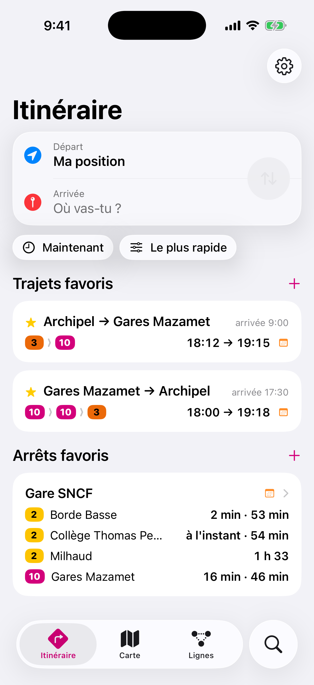
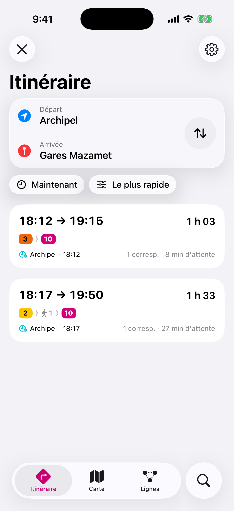
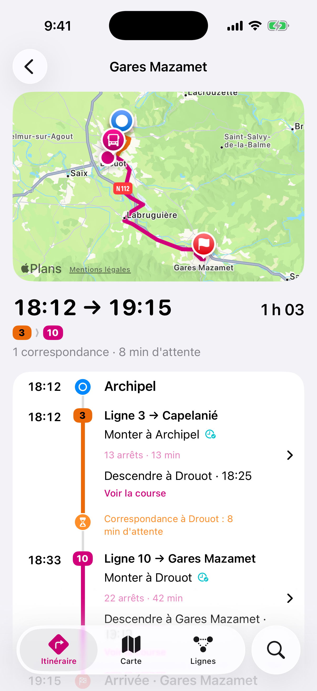
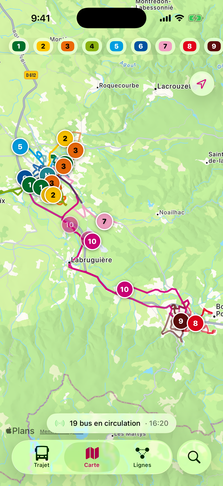
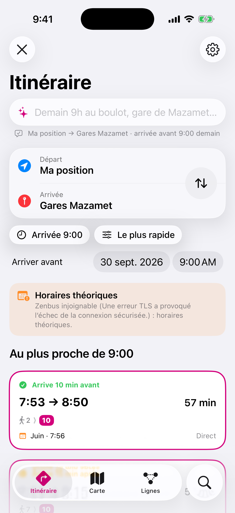
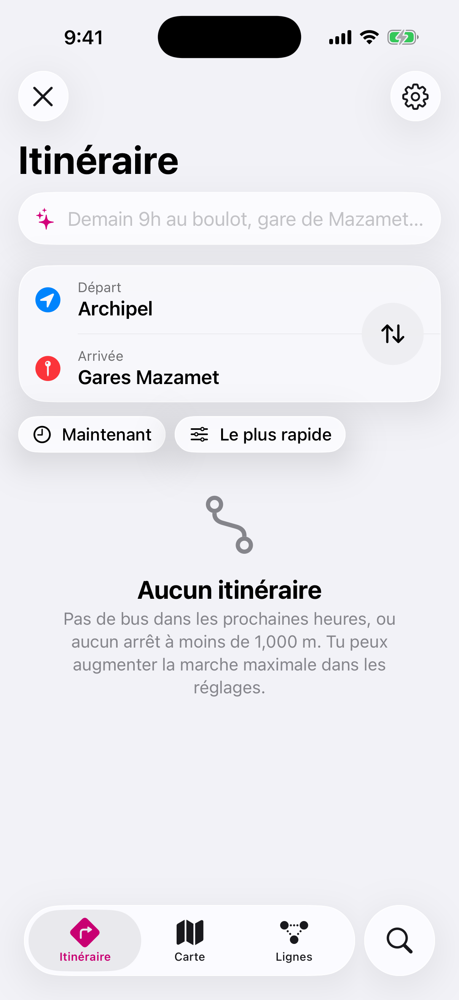

# Busio

App iPhone perso pour le réseau de bus **Libellus** (Castres-Mazamet) : les mêmes données que Zenbus, mieux rangées, avec ce qu'iOS sait faire de mieux (widgets, Live Activity, Siri, notifications).

- **Itinéraire** (onglet d'accueil) : départ = ta position (ou un lieu), arrivée = adresse, lieu (Plans) ou arrêt. Heure facultative : *maintenant*, *partir à* ou *arriver avant*. Busio combine les lignes avec correspondances et marche, au choix *le plus rapide*, *le moins de correspondances* ou *le moins d'attente*.
- **Recherche en phrase** : « demain 9h au boulot », « gare de Mazamet avant 8h30 », « de l'Archipel à la gare à 18h30 » remplissent le formulaire (dictée comprise). Analyse française sur l'appareil, Apple Intelligence en renfort si elle est disponible. *Maison* et *Travail* se règlent dans Réglages › Lieux.
- **Trajet suivi** : Busio vérifie le temps réel toutes les 45 s. Si un retard fait sauter une correspondance (ou supprime un bus), il prévient et propose un **plan B** depuis l'arrêt de correspondance, à suivre en un geste.
- **Dans le bus** : le GPS reconnaît que tu roules sur le tracé de ta ligne, compte les arrêts restants (Live Activity) et envoie « Descends au prochain arrêt » ; il signale aussi un arrêt dépassé. Sans GPS, le rappel part à l'heure prévue.
- **Arriver avant 9:00** : Busio propose le bus qui arrive juste avant **et** celui juste après.
- **Trajets favoris** (aucun par défaut) : « Archipel → Gares Mazamet, arrivée 9:00 du lundi au vendredi » en un geste, dans les widgets et avec Siri. Création du retour en un geste.
- **Carte** : tous les bus en circulation, rafraîchis toutes les 10 s, tracés des lignes, filtre par ligne.
- **Lignes** : schéma de chaque ligne avec les bus en route et le prochain passage à chaque arrêt.
- **Arrêts** : recherche, arrêts à proximité, favoris, départs groupés par ligne et direction, détail d'une course arrêt par arrêt.
- **Widgets** écran d'accueil et écran verrouillé (un trajet favori au choix), **Live Activity** qui suit l'étape en cours (marche, bus, correspondance), bouton **Centre de contrôle / bouton Action**.
- **Siri / Raccourcis** : « Prochain trajet avec Busio », « Suivre mon trajet avec Busio ».
- **Notifications** : « pars maintenant », retards et suppressions.

SwiftUI iOS 26 (Liquid Glass), Swift 6, aucune dépendance serveur.

| Itinéraire | Résultats | Détail | Carte |
| --- | --- | --- | --- |
|  |  |  |  |

| En phrase | Trajet suivi (plan B) |
| --- | --- |
|  |  |

*Captures générées automatiquement dans le simulateur avec les vraies données (workflow **Screenshots**).*

## Calcul d'itinéraire

`BusioKit/Sources/BusioKit/Engine/JourneyPlanner.swift` implémente **RAPTOR** : chaque « tour » ajoute un bus (tour 1 = direct, tour 2 = une correspondance…), ce qui donne pour chaque heure de départ le meilleur itinéraire par nombre de correspondances.

- Marche vers/depuis tous les arrêts à moins de 1 km (réglable), correspondances à pied jusqu'à 400 m, marge de correspondance de 2 min (réglable).
- Montée au dernier arrêt possible demandant le moins de marche ; marche finale pénalisée (mieux vaut 1 min de plus que 10 min à pied).
- Plusieurs départs successifs, sans doublon ni itinéraire dominé (partir plus tard et arriver plus tôt élimine l'autre).
- Temps réel Zenbus pris en compte (retards, suppressions, bus déjà passés) ; horaires théoriques pour les autres jours.

Trajet suivi (`Engine/JourneyMonitor.swift`, `Engine/JourneyTracker.swift`) :

- Les mêmes bus sont retrouvés à chaque actualisation (même entre GTFS et Zenbus), marches recalées sur les nouveaux horaires.
- Correspondance *juste* sous 1 min de marge, *ratée* sous 0 : plan B calculé depuis l'arrêt de correspondance, en excluant le bus menacé.
- GPS : position projetée sur le tracé réel de la ligne (variantes Zenbus), montée détectée quand on avance au-delà de l'arrêt en roulant, descente quand on s'arrête à l'arrêt. Testé sur des trajets simulés le long des vraies lignes.

## Fiabilité des données

Busio ne doit jamais afficher un horaire faux sans le dire. Chaque horaire porte son niveau de confiance : **En direct** (bus suivi par GPS), **Estimé**, **Prévu** (grille Zenbus du jour) ou **Théorique** (horaires publiés).

| Source | Rôle |
| --- | --- |
| API Zenbus (`zenbus.net/publicapp`, protobuf) | Source principale, identique à l'app officielle : grille du jour, positions GPS, estimations, suppressions, messages trafic. |
| GTFS Libellus (data.gouv.fr, ODbL) | Secours : produit par Zenbus avec les mêmes identifiants. Un test vérifie qu'il colle à la grille réellement exploitée (100 % des courses du 28/09/2026). |
| Données embarquées | Instantané réseau + GTFS dans l'app : fonctionne dès le premier lancement, même hors ligne. |

Règles appliquées (voir `BusioKit/Sources/BusioKit/Store/TransitService.swift`) :

1. Pour chaque sens de ligne et chaque jour, **Zenbus fait foi s'il a publié la grille de ce jour**. Sinon, horaires théoriques GTFS, avec un bandeau explicite. Ce cas existe vraiment : le 29/09/2026 à 11 h, Zenbus renvoyait encore la grille de la veille.
2. Zenbus injoignable : derniers relevés du jour (sans suivi GPS), puis GTFS.
3. Un bus à quai au terminus n'est jamais considéré parti avant son heure de départ (heure serveur Zenbus).
4. Écran « Réglages › État des sources » : dernier relevé, jour publié par Zenbus, validité du GTFS, bouton pour tout retélécharger, lien vers Zenbus pour comparer.

## Installer sur ton iPhone (Apple ID gratuit)

Prérequis : un Mac avec **Xcode 26** ou plus récent, ton iPhone et un câble.

1. Clone le dépôt et ouvre le dossier :
   ```sh
   git clone https://github.com/seishiiinsan/busio.git && cd busio
   ```
2. Crée ta config de signature :
   ```sh
   cp Config/Local.xcconfig.example Config/Local.xcconfig
   ```
   Dans `Config/Local.xcconfig`, mets ton **Team ID** (Xcode › Settings › Accounts › ton Apple ID : l'identifiant de la *Personal Team*) et un préfixe d'identifiant unique (ex. `fr.tonprenom`).
3. Ouvre `Busio.xcodeproj` (ou `make open` si tu as `brew install xcodegen`).
4. Branche l'iPhone, active le **Mode développeur** (Réglages › Confidentialité et sécurité), choisis l'iPhone comme destination puis **Run** (⌘R).
5. Au premier lancement : Réglages › Général › VPN et gestion de l'appareil › fais confiance à ton Apple ID.

Avec un Apple ID gratuit, l'app **expire au bout de 7 jours** : rebranche l'iPhone et relance **Run** pour la renouveler (tes réglages sont conservés). Un compte gratuit gère un seul App Group par app (Busio n'en utilise qu'un) et 10 identifiants d'app par semaine (Busio en utilise 2 : l'app et ses widgets).

### Live Activity automatique chaque matin

Sans compte développeur payant, pas de serveur push : iOS réveille Busio en arrière-plan quand il le juge bon. Pour un suivi garanti :

1. **Raccourcis** › Automatisation › **+** › **Heure de la journée** (ex. 8 h 15, du lundi au vendredi) › **Exécuter immédiatement**.
2. Action **Busio › Suivre mon trajet**, en choisissant ton trajet favori.

Le compte à rebours s'affiche sur l'écran verrouillé, correspondances comprises ; le bouton ↻ de la Live Activity le met à jour avec le temps réel. Fais la même chose pour le retour.

Le suivi GPS dans le bus (alerte de descente) démarre quand Busio est ouvert : après une automatisation, ouvre l'app une fois. iOS affiche alors l'indicateur de localisation bleu jusqu'à l'arrivée.

## Structure

```
BusioKit/            Moteur (Swift package, testé sur Linux et macOS)
  Proto/             Sous-ensemble du protocole temps réel Zenbus
  Sources/BusioKit/  Zenbus (client + mapping), GTFS, calcul d'itinéraire, cache, favoris
  Tests/             Tests sur données réelles (Fixtures + données embarquées)
Busio/               App SwiftUI (Itinéraire, Carte, Lignes, Arrêts, Réglages, Accueil)
BusioWidgets/        Widgets, Live Activity, bouton de contrôle
Shared/              Code commun app + widgets (App Group, Live Activity, alertes, intents)
Config/              Réglages de signature (xcconfig)
Tools/Probe/         Sonde des API (diagnostic)
project.yml          Définition XcodeGen du projet Xcode
```

## Développement

```sh
make test      # tests du moteur (swift test)
make project   # régénère Busio.xcodeproj après modification de project.yml
make proto     # régénère le code protobuf (brew install protobuf swift-protobuf)
```

La CI (GitHub Actions, macOS) lance les tests, compile l'app et les widgets pour le simulateur à chaque push. Le workflow **Refresh seed data** met à jour les données embarquées.

### Dépannage

- *« Provisioning profile … App Groups »* : vérifie que le préfixe dans `Local.xcconfig` est unique, puis relance. L'App Group sert à partager les horaires entre l'app et les widgets.
- *Horaires « Théoriques » toute la journée* : Zenbus n'a pas publié la grille du jour ; comparer avec l'app Zenbus via Réglages › État des sources.

## Données et licence

Temps réel : Zenbus. Horaires théoriques : Communauté d'agglomération de Castres-Mazamet, GTFS Libellus sous licence ODbL (transport.data.gouv.fr). Busio n'est ni affiliée à Libellus ni à Zenbus.
